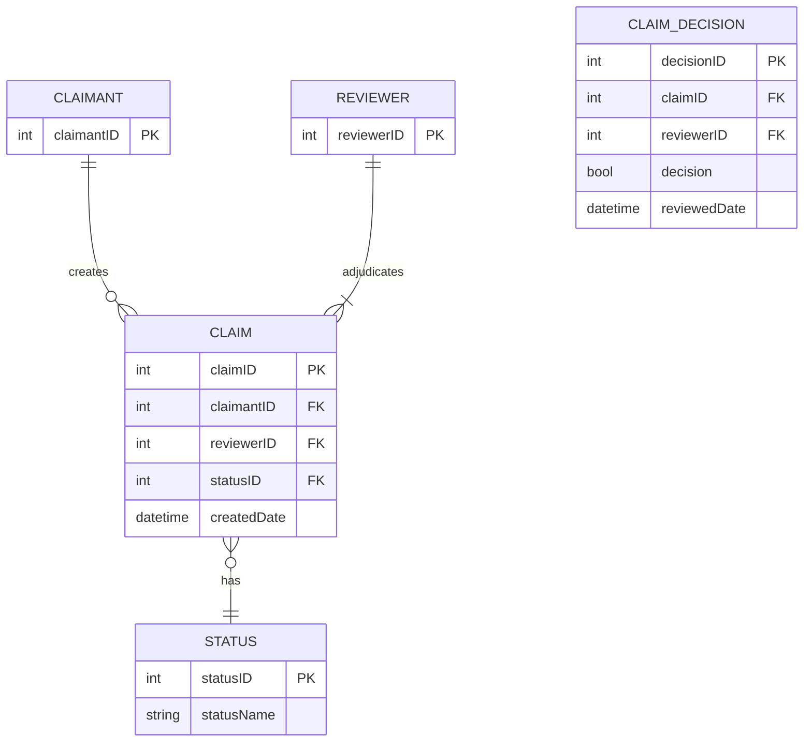

```mermaid
erDiagram
    CLAIMANT ||--o{ CLAIM : creates
    REVIEWER ||--|{ CLAIM : adjudicates
    CLAIM }o--|| STATUS : has

    CLAIM {
        int claimID PK
        int claimantID FK
        int reviewerID FK
        int statusID FK
        datetime createdDate
    }

    CLAIM_DECISION {
        int decisionID PK
        int claimID FK
        int reviewerID FK
        bool decision
        datetime reviewedDate
    }

    STATUS {
        int statusID PK
        string statusName
    }

    CLAIMANT {
        int claimantID PK
    }

    REVIEWER {
        int reviewerID PK
    }
```
